# Intelli Architecture — Overview

Below is a high-level architecture diagram (Mermaid) showing the main components
and data flows for Intelli.

```mermaid
flowchart TD
  subgraph ElectronShell["Electron Browser Shell (browser-shell/)"]
    BrowserUI["Browser UI\n(tabs + nav bar + panels)"]
    PanelSystem["Chrome Panels (360 px)\nbookmarks · history · settings\nclear-data · dev-addons"]
    TabBridge["Tab Context Bridge\n(browser.js + preload)"]
    Splash["Splash Screen\n(splash.html)"]
    MainProc["Electron Main Process\n(main.js)"]
  end

  subgraph AgentGateway["Agent Gateway (agent-gateway/ — FastAPI :8080)"]
    Router["HTTP Router\n(app.py)"]
    Supervisor["Supervisor & Validator"]
    ToolProxy["Tool Proxy (sandbox worker)"]

    subgraph Security["Security Middleware"]
      Auth["Bearer Token Auth\n& RBAC"]
      RateLimit["Rate Limiter"]
      ContentFilter["Content Filter\n(literal + regex)"]
      KillSwitch["Kill-Switch"]
      Approvals["Approval Queue\n(SSE stream)"]
    end

    subgraph CoreSubsystems["Core Subsystems"]
      Scheduler["Task Scheduler"]
      Memory["Agent Memory\n(key-value + TTL)"]
      VectorMemory["Vector Memory\n(embedding store)"]
      Webhooks["Webhook Dispatcher\n(retry + HMAC)"]
      Metrics["Prometheus Metrics"]
      Audit["Audit Log\n(append-only JSONL)"]
      Consent["Consent / Context Timeline"]
      Capabilities["Capability Manifests"]
      KeyMgmt["Provider Key Manager\n(Vault / keyring / env)"]
      Failover["Provider Failover"]
    end

    subgraph AgentFeatures["Agent Features"]
      Notifier["Notifier\n(Telegram · Discord · Slack)"]
      Notes["Notes / Knowledge Base\n(local Markdown)"]
      CredStore["Credential Store\n(OS keychain + AES-256-GCM)"]
      A2A["Agent-to-Agent (A2A)\n(persona task routing)"]
      PluginLoader["Plugin Loader\n(pip / zip / GitHub)"]
      Voice["Voice I/O\n(STT + TTS)"]
      Canvas["Canvas Manager\n(structured output)"]
      MCPClient["MCP Client\n(Model Context Protocol)"]
      Personas["Personas"]
      Sessions["Session History"]
      Watcher["Page Diff Watcher"]
      Workspace["Workspace / Skills"]
      Compaction["Context Compaction"]
    end

    subgraph ToolLayer["Tool Layer"]
      BrowserTools["Browser Automation"]
      WebTools["Web Tools\n(fetch / search)"]
      PDFReader["PDF Reader"]
      VideoFrames["Video Frame Analysis\n(ffmpeg + vision)"]
      CodingTools["Coding Tools"]
    end

    subgraph AdminUI["Admin UI (24 pages — /ui/)"]
      UIPages["status · audit · approvals · users\nproviders · schedule · metrics · memory\ncontent-filter · rate-limits · webhooks\ncapabilities · consent · tab_permission\nchat · canvas · personas · mcp\nsessions · analytics · watchers\nsetup · workspace · index"]
    end
  end

  subgraph External["External / Optional"]
    LocalModels["Local Models\n(Ollama / GGML)"]
    CloudProviders["Cloud LLM Providers\n(OpenAI / Anthropic / OpenRouter)"]
    VaultSrv["HashiCorp Vault"]
    SIEM["SIEM / Log Aggregator"]
    NotifChannels["Notification Channels\n(Telegram / Discord / Slack)"]
    MCPServers["MCP Servers"]
  end

  BrowserUI -->|"DOM snapshot (policy-gated)"| TabBridge
  BrowserUI <-->|"panel-visible IPC"| PanelSystem
  TabBridge -->|"structured context"| MainProc
  MainProc -->|"spawn / IPC"| Router
  Splash --> MainProc

  Router --> Auth
  Auth --> RateLimit
  RateLimit --> ContentFilter
  ContentFilter --> KillSwitch
  KillSwitch --> Approvals
  Approvals --> Supervisor
  Supervisor --> ToolProxy

  Supervisor --> Scheduler
  Supervisor --> Memory
  Supervisor --> VectorMemory
  Router --> Metrics
  Router --> Audit
  Router --> Consent
  Router --> Webhooks
  Router --> Capabilities
  Router --> KeyMgmt
  Router --> AdminUI
  Router --> Notifier
  Router --> Notes
  Router --> CredStore
  Router --> A2A
  Router --> PluginLoader
  Router --> Sessions
  Router --> Watcher
  Router --> Canvas
  Router --> MCPClient
  Router --> Voice

  Supervisor --> ToolLayer

  ToolProxy -->|"sandboxed exec"| BrowserUI
  Supervisor --> LocalModels
  Supervisor --> CloudProviders
  Failover --> LocalModels
  Failover --> CloudProviders
  KeyMgmt --> VaultSrv
  Audit -->|"optional ship"| SIEM
  Notifier --> NotifChannels
  MCPClient --> MCPServers

  classDef infra fill:#c8d6e5,stroke:#2c3e50,stroke-width:1px;
  classDef security fill:#ffd3b4,stroke:#e07b39,stroke-width:1px;
  classDef electron fill:#d0f0c0,stroke:#27ae60,stroke-width:1px;
  classDef agent fill:#e8daff,stroke:#7c4dff,stroke-width:1px;
  class CloudProviders,LocalModels,VaultSrv,SIEM,NotifChannels,MCPServers infra;
  class Auth,RateLimit,ContentFilter,KillSwitch,Approvals security;
  class BrowserUI,TabBridge,Splash,MainProc electron;
  class Notifier,Notes,CredStore,A2A,PluginLoader,Voice,Canvas,MCPClient,Personas,Sessions,Watcher,Workspace,Compaction agent;
```

---

## Component Summary

| Component | Location | Technology | Role |
|---|---|---|---|
| Electron Main Process | `browser-shell/main.js` | Electron 29 + Node.js | Spawns/kills gateway, manages windows; `panel-visible` + `toggle-chrome-devtools` IPC |
| Browser UI | `browser-shell/src/browser.{html,js,css}` | Chromium renderer | Multi-tab browser chrome + 5 overlay panels (bookmarks, history, settings, clear-data, dev-addons) |
| Chrome Panel System | `browser-shell/src/browser.{html,js,css}` | DOM overlay (360 px) | Bookmark star, zoom indicator, ⋮ menu, per-panel data loaders |
| Tab Context Bridge | `browser-shell/preload.js` | contextBridge API | Isolates renderer from Node.js |
| Agent Gateway | `agent-gateway/app.py` | FastAPI + uvicorn | Central HTTP API (60+ endpoints) |
| Supervisor | `agent-gateway/supervisor.py` | Python | Schema validation + manifest-driven approval routing |
| Tool Proxy | `agent-gateway/sandbox/proxy.py` | Python subprocess | Sandboxed action execution |
| Auth | `agent-gateway/auth.py` | PBKDF2 + Bearer | Login, tokens, RBAC, user management |
| Audit Log | `agent-gateway/audit.log` | Append-only JSONL | Immutable event trail; optional AES-256-GCM encryption |
| Content Filter | `agent-gateway/content_filter.py` | Regex + literal | Pre-call deny rules |
| Rate Limiter | `agent-gateway/rate_limit.py` | Sliding window | Per-IP/user request caps |
| Approval Queue | `agent-gateway/supervisor.py` | Async queue + SSE | Human-in-the-loop sign-off |
| Scheduler | `agent-gateway/scheduler.py` | Background daemon | Recurring tool-call tasks |
| Agent Memory | `agent-gateway/agent_memory.py` | JSON + TTL | Per-agent key-value store |
| Vector Memory | `agent-gateway/memory_store.py` | Embedding store | Semantic long-term recall |
| Webhooks | `agent-gateway/webhooks.py` | HTTPX + HMAC retry | Push events to external URLs |
| Metrics | `agent-gateway/metrics.py` | Prometheus client | Per-tool counters + histograms |
| Provider Keys | `agent-gateway/providers/key_rotation.py` | Vault / keyring / env | LLM credential lifecycle |
| Provider Failover | `agent-gateway/failover.py` | Python | Automatic fallback across providers |
| Notifier | `agent-gateway/notifier.py` | Python | Outbound push to Telegram / Discord / Slack |
| Notes / Knowledge Base | `agent-gateway/notes.py` | Local Markdown | Search and manage local knowledge files |
| Credential Store | `agent-gateway/credential_store.py` | OS keychain + AES-256-GCM | Named secret management |
| Agent-to-Agent (A2A) | `agent-gateway/a2a.py` | Python | Route tasks between personas; async task queue |
| Plugin Loader | `agent-gateway/plugin_loader.py` | pip / zip / GitHub | Dynamic plugin install and tool registration |
| Voice I/O | `agent-gateway/voice.py` | STT + TTS | Speech input and output |
| Canvas | `agent-gateway/canvas_manager.py` | Python | Structured multi-block output |
| MCP Client | `agent-gateway/mcp_client.py` | MCP protocol | External tool and resource integration |
| Personas | `agent-gateway/personas.py` | Python | Named agent personas with system prompts |
| Session History | `agent-gateway/sessions.py` | Python | Per-session conversation storage |
| Page Diff Watcher | `agent-gateway/watcher.py` | Python | Monitor URLs for content changes |
| Workspace / Skills | `agent-gateway/workspace_manager.py` | Python | Skill manifest management |
| Context Compaction | `agent-gateway/compaction.py` | Python | Auto-summarise long context windows |
| Browser Tools | `agent-gateway/tools/browser_tools.py` | Playwright / CDP | Headless browser automation |
| Web Tools | `agent-gateway/tools/web_tools.py` | Python | Web fetch, search, summarise |
| PDF Reader | `agent-gateway/tools/pdf_reader.py` | Python | Text + structure extraction from PDF |
| Video Frame Analysis | `agent-gateway/tools/video_frames.py` | ffmpeg + vision | Frame extraction + vision model description |
| Coding Tools | `agent-gateway/tools/coding_tools.py` | Python | Code generation, execution, linting |
| Admin UI | `agent-gateway/ui/` | Vanilla JS (24 pages) | Full-featured admin console |
| CLI | `agent-gateway/gateway_ctl.py` | argparse | 20 subcommands covering all APIs |
| OpenAPI spec | `agent-gateway/openapi.yaml` | OpenAPI 3.0.3 | Full endpoint documentation |
| Log Shipper | `scripts/log_shipper.py` | Python | NDJSON audit log forwarding to SIEM |

---

## Notes

- The **Tab Context Bridge** serializes the active tab to a structured snapshot
  and enforces per-site permissions and redaction rules before any context leaves
  the renderer process.
- The **Chrome Panel System** renders five `position:fixed` overlay panels (bookmarks,
  history, settings, clear-data, dev-addons) inside the chrome renderer. When any panel
  is open, `browser.js` calls `electronAPI.setPanelVisible(true)` which fires the
  `panel-visible` IPC handler in `main.js`; `tabBounds()` subtracts `PANEL_WIDTH = 360 px`
  from the active BrowserView so the DOM panel is never hidden behind it.
- The **Agent Gateway** is the local HTTP/IPC endpoint; on desktop it is spawned
  by Electron and its lifecycle is tied to the browser window.
- The **Supervisor** performs schema validation, escaping, sanitization, and
  enforces execution policies (approval thresholds, rate limits, RBAC, content
  filter) on every incoming tool call. Manifest-driven routing overrides heuristic
  risk scoring when a capability manifest is present for the tool.
- The **Sandbox** runs in a subprocess with a strict action whitelist and optional
  Docker isolation with `--cap-drop ALL`, seccomp profile, read-only filesystem,
  and CPU/memory quotas.
- All persistent data (agent memory, consent log, audit log, revoked tokens, notes,
  credentials, session history) is stored locally. Vault is used in production for
  API key storage.
- Transport: gateway listens on `127.0.0.1:8080` by default; put nginx or Caddy
  in front for TLS in network-facing deployments.
- The **Plugin Loader** discovers a `plugins/` directory and any installed pip packages
  that expose an `intelli_plugin.json` manifest, dynamically registering their tools
  at startup.
