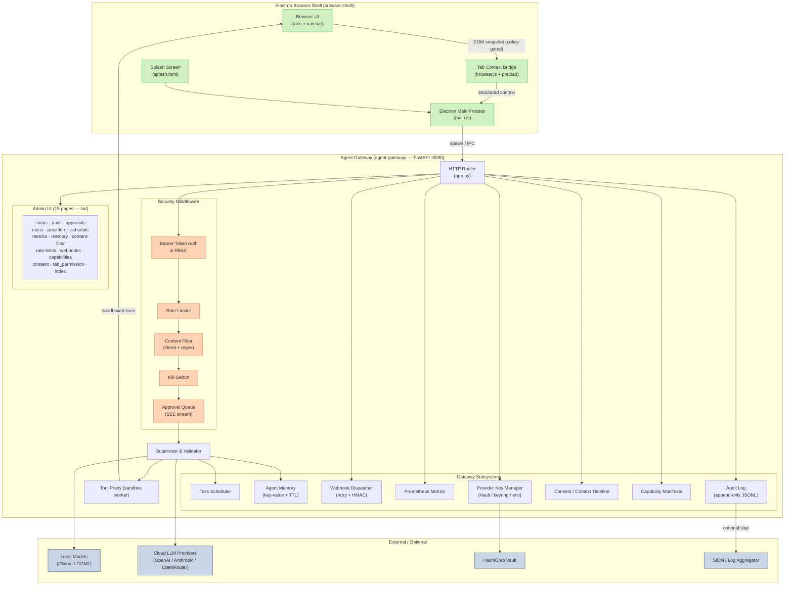

# Intelli Architecture — Overview

Below is a high-level architecture diagram (Mermaid) showing the main components
and data flows for Intelli.

---

## Component Summary

| Component | Location | Technology | Role |
|---|---|---|---|
| Electron Main Process | `browser-shell/main.js` | Electron 29 + Node.js | Spawns/kills gateway, manages windows |
| Browser UI | `browser-shell/browser.{html,js,css}` | Chromium renderer | Multi-tab browser chrome |
| Tab Context Bridge | `browser-shell/preload.js` | contextBridge API | Isolates renderer from Node.js |
| Agent Gateway | `agent-gateway/app.py` | FastAPI + uvicorn | Central HTTP API |
| Supervisor | `agent-gateway/supervisor.py` | Python | Schema validation + routing |
| Tool Proxy | `agent-gateway/tool_proxy.py` | Python subprocess | Sandboxed action execution |
| Auth | `agent-gateway/auth.py` | PBKDF2 + Bearer | Login, tokens, RBAC |
| Audit Log | `agent-gateway/audit_log.py` | Append-only JSONL | Immutable event trail |
| Content Filter | `agent-gateway/content_filter.py` | Regex + literal | Pre-call deny rules |
| Rate Limiter | `agent-gateway/rate_limit.py` | Sliding window | Per-IP/user request caps |
| Approval Queue | `agent-gateway/approvals.py` | Async queue + SSE | Human-in-the-loop sign-off |
| Scheduler | `agent-gateway/scheduler.py` | APScheduler | Recurring tool-call tasks |
| Agent Memory | `agent-gateway/agent_memory.py` | JSON + TTL | Per-agent key-value store |
| Webhooks | `agent-gateway/webhooks.py` | HTTPX + HMAC retry | Push events to external URLs |
| Metrics | `agent-gateway/metrics.py` | Prometheus client | Per-tool counters + histograms |
| Provider Keys | `agent-gateway/key_rotation.py` | Vault / keyring / env | LLM credential lifecycle |
| Admin UI | `agent-gateway/ui/` | Vanilla JS (15 pages) | Full-featured admin console |
| CLI | `agent-gateway/gateway_ctl.py` | Click | 19 subcommands covering all APIs |
| OpenAPI spec | `agent-gateway/openapi.yaml` | OpenAPI 3.0.3 | 20 named tags, full endpoint docs |

---

## Notes

- The **Tab Context Bridge** serializes the active tab to a structured snapshot
  and enforces per-site permissions and redaction rules before any context leaves
  the renderer process.
- The **Agent Gateway** is the local HTTP/IPC endpoint; on desktop it is spawned
  by Electron and its lifecycle is tied to the browser window.
- The **Supervisor** performs schema validation, escaping, sanitization, and
  enforces execution policies (approval thresholds, rate limits, RBAC, content
  filter) on every incoming tool call.
- The **Tool Proxy** runs in a subprocess with a strict action whitelist; no
  arbitrary code execution is supported.
- All persistent data (agent memory, consent log, audit log, revoked tokens) is
  stored locally. Vault is used in production for API key storage.
- Transport: gateway listens on `127.0.0.1:8080` by default; put nginx or Caddy
  in front for TLS in network-facing deployments.
