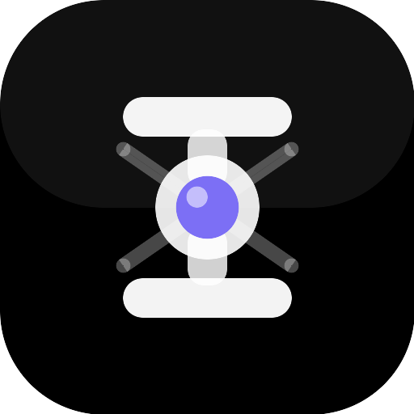

<p align="center">
  
  <br/><br/>
  
</p>

# Intelli — AI-native browser

Intelli is a privacy-first browser with native AI/agent integration.
It combines a **Tab Context Bridge**, a hardened **Agent Gateway**, an Electron desktop browser
shell with multi-tab support, a live admin sidebar, and a hybrid supervisor pipeline that
validates, redacts, approves, and audits every AI tool call before execution.

> **License** — Source-available, non-commercial.
> Free for personal / educational / research use. Commercial use requires written permission.
> See [LICENSE](LICENSE) for full terms.

------

## Repository layout

| Path | Purpose |
|------|---------|
| `ROADMAP.md` | Implementation log — all completed features with notes |
| `ARCHITECTURE.md` | Mermaid architecture diagram (all subsystems) |
| `THREAT_MODEL.md` | Threat model and privacy controls |
| `SECURITY.md` | Security posture and known mitigations |
| `LICENSE` | Source-available non-commercial license |
| `agent-gateway/` | Local agent gateway (FastAPI + 1 100+ tests) |
| `agent-gateway/ui/` | 24 dark-mode admin UI pages |
| `agent-gateway/gateway_ctl.py` | CLI management tool for all admin APIs |
| `agent-gateway/openapi.yaml` | Full OpenAPI 3.0.3 spec (20+ named tags) |
| `agent-gateway/addons.py` | Addon JS-injection manager + persistence |
| `agent-gateway/tab_snapshot.py` | In-process active-tab HTML snapshot store |
| `agent-gateway/notifier.py` | Outbound push notifications (Telegram / Discord / Slack) |
| `agent-gateway/notes.py` | Local Markdown knowledge base (~/.intelli/notes/) |
| `agent-gateway/credential_store.py` | OS keychain + AES-256-GCM encrypted credential store |
| `agent-gateway/a2a.py` | Agent-to-agent task routing across personas |
| `agent-gateway/plugin_loader.py` | Plugin installer + dynamic tool registry |
| `agent-gateway/voice.py` | Voice I/O — speech-to-text and text-to-speech |
| `agent-gateway/canvas_manager.py` | Canvas / structured multi-block output |
| `agent-gateway/mcp_client.py` | Model Context Protocol client |
| `agent-gateway/personas.py` | Custom agent personas |
| `agent-gateway/sessions.py` | Per-session conversation history |
| `agent-gateway/watcher.py` | Page diff watcher — monitor URLs for changes |
| `agent-gateway/memory_store.py` | Vector memory store |
| `agent-gateway/workspace_manager.py` | Workspace and skill management |
| `browser-shell/` | Electron 29 desktop browser wrapping the gateway (`npm start`) |
| `browser-shell/main.js` | Main process — tab management, IPC, window controls |
| `browser-shell/preload.js` | Context-bridge API surface exposed to chrome renderer |
| `browser-shell/src/` | Chrome renderer — tab bar, address bar, sidebar, addons |
| `docs/` | Deployment, developer guide, and operator runbook |
| `scripts/log_shipper.py` | SIEM audit log shipper sidecar |

---

## Agent gateway — feature summary

The gateway (`agent-gateway/`) is the core component:

| Feature | Capability |
|---------|------------|
| **Schema validation** | Every tool call checked against JSON Schema |
| **Capability manifests** | Per-tool `required_capabilities` and risk levels |
| **Human-in-the-loop approvals** | High-risk tool calls queue for admin sign-off; SSE stream |
| **RBAC & token auth** | Bearer tokens, refresh/revoke lifecycle |
| **Per-user tool scoping** | Granular allow-list per user (`alice` can only call `file.read`) |
| **Emergency kill-switch** | Instantly blocks all tool calls for incident response |
| **Content filtering** | Literal and regex deny-rules applied before every tool call |
| **Rate limiting** | Per-token and global caps, configurable via UI and API |
| **Agent memory** | Persistent key-value store per agent with optional TTL |
| **Vector memory** | Semantic embedding store for long-term recall |
| **Scheduler** | Recurring tool-call tasks with interval, history, and live countdown |
| **Provider key management** | Store, rotate, and track expiry of LLM API keys |
| **Provider failover** | Automatic fallback across LLM providers on failure |
| **Consent / context timeline** | Append-only log of every tab snapshot shared with an agent |
| **Audit log** | Immutable JSONL trail — tail, filter, group-by, CSV export, live follow |
| **Encrypted audit log** | Optional AES-256-GCM per-line encryption via `INTELLI_AUDIT_ENCRYPT_KEY` |
| **Metrics** | Per-tool call counts and p50 / mean latency histograms |
| **Approval webhooks** | Push notifications to external systems on queue events |
| **Chat proxy** | Streaming proxy to OpenAI / Anthropic / OpenRouter / Ollama |
| **GDPR export/erase** | Full actor data export and erasure via API |
| **Tab snapshot** | Active-tab HTML pushed automatically; agents read via `GET /tab/snapshot` |
| **Addon system** | Agents write and activate JS addons injected into active tab at runtime |
| **Browser automation** | Headless browser tools — click, screenshot, DOM query, form fill |
| **Web tools** | Fetch, search, and summarise web content |
| **PDF analysis** | Extract text and structure from PDF files |
| **Image upload** | Multimodal image input for vision-capable models |
| **Video frame analysis** | ffmpeg frame extraction + vision model description |
| **Coding agent** | Code generation, execution, and linting tools |
| **Canvas** | Structured multi-block output (text, code, data, charts) |
| **Sub-agents** | Spawn and orchestrate child agent tasks |
| **Personas** | Named agent personas with distinct system prompts |
| **Agent-to-agent (A2A)** | Route tasks between personas; async task queue |
| **Session history** | Per-session conversation history stored and searchable |
| **MCP client** | Model Context Protocol tool and resource integration |
| **Page diff watcher** | Monitor URLs for changes and alert on diff |
| **Notification push** | Outbound alerts to Telegram / Discord / Slack |
| **Notes / knowledge base** | Local Markdown knowledge base; full-text search |
| **Secure credential store** | OS keychain + AES-256-GCM encrypted named credentials |
| **Plugin system** | Install pip/zip/GitHub plugins; dynamic tool registry |
| **Voice I/O** | Speech-to-text input and text-to-speech output |
| **Context compaction** | Automatic conversation summarisation to keep context within limits |
| **Skill ecosystem** | Workspace of reusable agent skills |
| **Analytics** | Usage analytics, session stats, and export |
| **Navigation guard** | Block or warn on navigation to risky domains |
| **Sandbox** | Subprocess + Docker isolated tool execution |

---

## Browser shell — feature summary

The Electron shell (`browser-shell/`) wraps the gateway with a full tabbed browser UI:

| Feature | Description |
|---------|-------------|
| **Multi-tab** | Create, switch, close tabs; each is an isolated BrowserView |
| **Live tab bar** | Tab bar stays in sync with main process via `tabs-updated` IPC events |
| **Address bar** | URL display, smart navigation, DuckDuckGo fallback for queries |
| **Bookmark star** | ★ button in address bar toggles bookmark for the current page; bookmark list in the panel |
| **Zoom indicator** | Zoom level badge in address bar; updated on `did-finish-load` |
| **Window controls** | Custom minimize / maximize / close buttons (hidden-titlebar mode) |
| **Admin sidebar** | 340 px `BrowserView` with the admin hub; toggle via Ctrl+Shift+A or ☰ |
| **⋮ App menu** | Three-dot native popup with History, Settings, Clear Data, Dev Addons items |
| **Chrome panels** | Five 360 px overlay panels (bookmarks, history, settings, clear-data, dev-addons); `panel-visible` IPC shrinks active BrowserView so panels are never hidden behind it |
| **Tab snapshot** | Page HTML pushed to gateway 1.8 s after each navigation |
| **Addon injection** | Polls `GET /tab/inject-queue` every 3 s; executes pending JS in active tab |
| **Keyboard shortcuts** | Ctrl+T new tab, Ctrl+W close, Ctrl+1-8 switch, Ctrl+L focus URL |

---

## Quickstart

### Linux / macOS
```bash
# 1. Create virtualenv and install dependencies
python3 -m venv agent-gateway/.venv
source agent-gateway/.venv/bin/activate
pip install -r agent-gateway/requirements.txt

# 2. Set admin password
export AGENT_GATEWAY_ADMIN_PASS="your-strong-password"

# 3. Start the gateway (development — auto-reload)
uvicorn app:app --app-dir agent-gateway --reload --host 127.0.0.1 --port 8080

# 4. Run all tests
python -m pytest -q
# Expected: 1100+ passed
```

### Windows (PowerShell)
```powershell
python -m venv agent-gateway/.venv
.\.venv\Scripts\Activate.ps1
pip install -r agent-gateway/requirements.txt
$env:AGENT_GATEWAY_ADMIN_PASS = "your-strong-password"
uvicorn app:app --app-dir agent-gateway --reload --host 127.0.0.1 --port 8080
```

Open `http://127.0.0.1:8080/ui/` to access the admin hub.

### Desktop browser (Electron) — recommended
```bash
cd browser-shell
npm install        # first time only
node generate-icon.js  # first time only — placeholder icon
npm start
# Starts the gateway automatically and opens the Intelli browser window
```

---

## Addon system

Agents (or the admin) can write, store, and activate JavaScript addons that are injected
directly into the active browser tab — similar in spirit to browser extensions:

```powershell
# Create an addon
curl -X POST http://127.0.0.1:8080/admin/addons `
  -H "Authorization: Bearer $TOKEN" `
  -H "Content-Type: application/json" `
  -d '{"name":"highlight","description":"Highlight links","code_js":"document.querySelectorAll(\"a\").forEach(a=>a.style.outline=\"2px solid lime\")"}'

# Activate it — code runs in active tab within 3 seconds
curl -X POST http://127.0.0.1:8080/admin/addons/highlight/activate `
  -H "Authorization: Bearer $TOKEN"
```

Endpoints: `GET/POST /admin/addons`, `GET/PUT/DELETE /admin/addons/{name}`,
`POST /admin/addons/{name}/activate`, `POST /admin/addons/{name}/deactivate`.

---

## Tab snapshot (agents read active page)

After every navigation the browser pushes the active tab's HTML to the gateway.
Agents retrieve it via `GET /tab/snapshot`:

```json
{
  "url": "https://example.com",
  "title": "Example Domain",
  "timestamp": "2026-01-01T12:00:00+00:00",
  "length": 1256,
  "html": "<!DOCTYPE html>..."
}
```

---

## Admin UI pages

All 24 pages are served at `http://127.0.0.1:8080/ui/<page>`.

| Page | Description |
|------|-------------|
| `index.html` | Searchable admin hub with nav cards — live status bar |
| `status.html` | Live gateway dashboard — kill-switch, alert config, top tool, scheduler ETA |
| `audit.html` | Audit log viewer — sort, filter, group-by, CSV export, live-tail |
| `approvals.html` | Pending approval queue — SSE live updates, approve / reject, auto-reject timer |
| `users.html` | User management — create, delete, roles, tool restrictions, last-seen chip |
| `providers.html` | LLM provider key management, rotation, expiry + chat proxy test panel |
| `schedule.html` | Scheduler — tasks, history, duration sparkline, bulk enable/disable |
| `metrics.html` | Per-tool call counts, p50 latency, bar chart, sparklines |
| `memory.html` | Agent memory browser — export-all / import, TTL display, inline edit |
| `content-filter.html` | Deny-rule management (literal + regex) with live test panel |
| `rate-limits.html` | Per-token and global rate-limit configuration + live usage snapshot |
| `webhooks.html` | Approval webhook registration — delivery history, retry highlight |
| `capabilities.html` | Tool capability manifest browser — risk and approval filters |
| `consent.html` | Context-sharing consent timeline viewer |
| `tab_permission.html` | Browser tab snapshot permission and per-origin redaction rules |
| `chat.html` | Streaming AI chat panel with provider selector |
| `canvas.html` | Structured multi-block canvas output viewer |
| `personas.html` | Agent persona management |
| `mcp.html` | MCP tool and resource browser |
| `sessions.html` | Per-session conversation history viewer |
| `analytics.html` | Usage analytics and session stats |
| `watchers.html` | Page diff watcher — monitor URLs for changes |
| `setup.html` | First-run setup wizard |
| `workspace.html` | Workspace and skill management |

---

## CLI (`gateway_ctl.py`)

```bash
cd agent-gateway

python gateway_ctl.py login
python gateway_ctl.py audit tail --n 50 --actor alice
python gateway_ctl.py audit follow --interval 5          # live stream, Ctrl-C to stop
python gateway_ctl.py audit export-csv --output report.csv
python gateway_ctl.py schedule list --next               # show countdown to next run
python gateway_ctl.py users permissions set alice file.read,noop
python gateway_ctl.py metrics top --n 5
python gateway_ctl.py content-filter add "bad-word" --mode literal
python gateway_ctl.py kill-switch on --reason "incident"
python gateway_ctl.py approvals list
python gateway_ctl.py memory export --output backup.json
python gateway_ctl.py provider-health list
```

See [agent-gateway/README.md](agent-gateway/README.md) for the full endpoint reference and environment variables.
